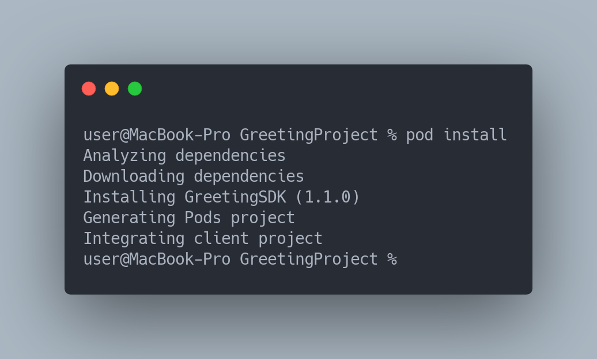
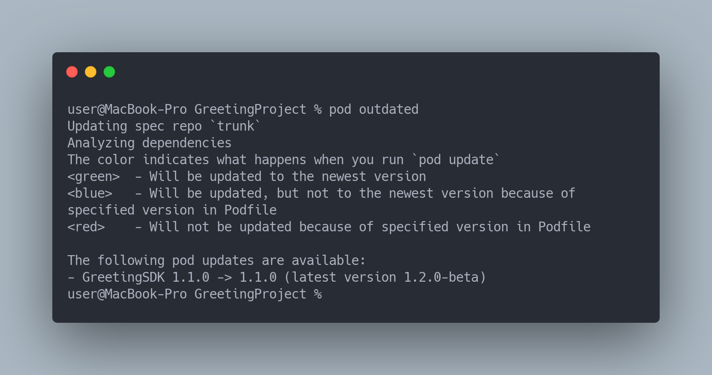

# GreetingSDK

## Overview

This repository is a part of 3 repository project, that demonstrates how [CocoaPods](https://cocoapods.org) can be used to provide both (a *release* and a *pre-release*) versions of an SDK without any hacks or code replacements.

Repositories:
* [GreetingSDK](https://github.com/DeveloperMaris/GreetingSDK)
* [GreetingProject](https://github.com/DeveloperMaris/GreetingProject)
* [GreetingCocoaPodsSpecs](https://github.com/DeveloperMaris/GreetingCocoaPodsSpecs)

## About

This is a demo SDK, which have tagged versions:
* 1.1.0
* 1.2.0-beta

## Installation

All versions are available through [CocoaPods](https://cocoapods.org).

1. Specify source repository in `Podfile`:
```
source 'https://github.com/DeveloperMaris/GreetingCocoaPodsSpecs'
```

2. Add SDK pod to `Podfile`:
```
pod 'GreetingSDK'
```

By just specifying `pod 'GreetingSDK'` without a specific version, it will automatically install the last available stable version, which is `1.1.0`, not the `1.2.0-beta`, because *it's beta*:



Also, if there would be an update available for the SDK, and also a new *beta* release too,  end-user would be inform that there is a *beta* version available, but it would automatically update only to the latest stable version.
For the outdated versions user can check using `pod outdated`:


Or in case if user is already on the latest stable version, it would still inform user about a newer version, but not install it:


